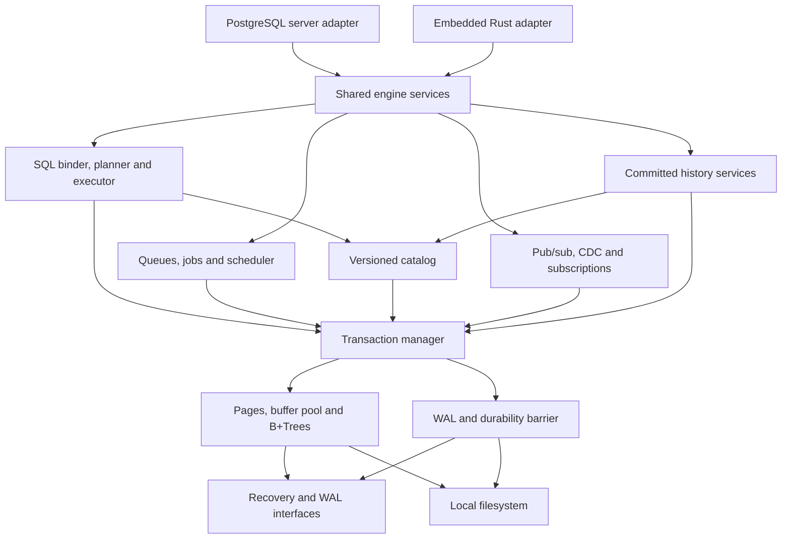

# Architecture

## Shared engine

The engine is a synchronous, storage-focused core with explicit I/O, clock, randomness and durability interfaces. Server networking and embedded adapters wrap the same transaction, catalog and query services. Async network tasks must not hold page latches across await points. Blocking storage work uses bounded execution capacity.

These approved module boundaries now have foundation Rust crates; most declare ownership without implementing database behavior. The detailed ownership, MSRV/target and dependency policy is in [modules.md](specs/modules.md); [modules.json](specs/modules.json) defines the direct acyclic graph.

| Module | Responsibility | Permitted dependencies |
| --- | --- | --- |
| `types` | Stable IDs, SQL values, errors, encodings | Small reviewed utilities |
| `io` | File ownership, positioned reads/writes, sync, injectable faults | Platform APIs |
| `recovery-api` | Owned recovery commands and WAL/durability traits | `types` |
| `storage` | Pages, allocation, buffer pool, B+Trees, overflow records | `types`, `io`, `recovery-api` |
| `wal` | Record framing, append and durable flush | `types`, `io`, `recovery-api` |
| `recovery` | Analysis, redo, undo and checkpoint orchestration | `types`, `wal`, `storage`, `recovery-api` |
| `txn` | MVCC, row/key/range locks, commit sequencing, savepoints | Storage and WAL services |
| `catalog` | Versioned schema, object IDs, grants, dependency graph | `txn` |
| `history` | Immutable transaction envelopes and temporal indexes | `txn`, `catalog` |
| `sql` | Parse, bind, logical plan, type checking | `types`, `catalog` |
| `planner` / `executor` | Optimization, physical operators, DML | `sql`, `txn`, storage access paths |
| `work` | Queue/job records, claims, retries, schedule materialization | `txn`, `catalog`, injected clock |
| `events` | Publication records, offsets, CDC, subscriptions | `txn`, `history`, catalog authorization |
| `engine` | Database lifecycle and bounded orchestration | Core services above |
| `embedded` | Safe Rust ownership, transactions, snapshots, shutdown | `engine` |
| `pgwire` | Protocol message/session types | `types` |
| `server` | Auth, cancellation and bounded runtime/transport | `types`, `engine`, `pgwire` |
| `admin` / `cli` | Backup, integrity checks, migrations, diagnostics | Public management services |

Dependency cycles are prohibited. Typed participant mutations and envelope installation belong to `txn`; catalog/history services use them from above. The transaction layer never calls back into catalog/history. `engine` wires lower-layer interfaces to concrete implementations. Transaction participation is an internal capability, not a plugin callback that may perform arbitrary I/O during commit.

The [format-v1 candidate](specs/persistent-format-v1.md) defines persisted identifiers, page/WAL framing and envelope bounds. Its fixtures and crash walkthroughs are [review evidence](specs/foundation-evidence.md), not an implemented recovery guarantee.

## Identifiers and scopes

Database UUID and timeline UUID identify a lineage. A transaction ID identifies an attempt and is not an ordering key. A 64-bit commit sequence number (CSN) orders committed transactions; gaps from failed reservations are allowed. WAL LSNs order physical recovery records and are not historical query cursors. Stable table, column, schema and row IDs survive rename and do not get recycled into another identity.

A durable cursor includes database, timeline, commit sequence, operation position and codec version. A restore fork creates a new timeline, preventing accidental reuse of cursors or idempotency state from another history branch.

## Transaction and commit protocol

1. Begin with a snapshot basis, authenticated principal, resource budget and optional bounded application metadata. Read committed refreshes its basis at each statement; repeatable read pins one basis for the transaction.
2. Stage row versions, catalog changes, queue/job/event operations and consumer-offset changes under one transaction ID. Validate names, types, authorization and quotas before applying mutations.
3. Acquire transaction locks and revalidate write conflicts, uniqueness, foreign keys and predicate protection required by the isolation level. Page latches protect memory structure; they do not replace transaction locks.
4. Produce one ordered logical mutation envelope containing all participants, stable IDs, historical schema references and transaction metadata. Savepoint rollback removes staged logical operations while physical undo remains recoverable.
5. Reserve a CSN at the commit sequencer. Install the required ledger/temporal and serving-index mutations under the still-uncommitted transaction. Append the physical WAL records and the final commit record with CSN and envelope integrity fields.
6. The local durability barrier flushes through the commit LSN before publishing commit visibility or acknowledging success. Group commit may share one flush while preserving ordering. A checkpoint is not required for each commit.
7. Publish the transaction's committed status and advance the visible CSN only through the complete durable prefix. Release transaction locks and snapshot pins. Serving indexes and the logical ledger become visible together through transaction visibility.
8. Wake dispatchers and subscribers after durability. Wakeups are hints: consumers discover durable records by scanning their indexes after restart, so a crash between commit and wakeup does not lose work.

Readers MUST never observe a partial transaction, a CSN whose predecessors are unresolved, or a ledger/event/job entry from an aborted transaction. A flush failure poisons the affected write path until the database reopens and recovers. A connection lost after durable commit but before response has an unknown outcome; retry requires an application idempotency key or outcome lookup.

The committed ledger is transactionally authoritative for logical provenance and reconstruction. Physical WAL is authoritative for page recovery. Recovery MUST restore ledger and serving indexes to the same committed prefix; neither is a substitute for a verified physical backup. Historical serving projections can be rebuilt from retained ledger data and schema versions.

## Concurrency

The first storage bring-up may use a single serialized writer with concurrent snapshot readers, explicitly marked experimental. The 1.0 target permits concurrent transactions with row/key locking, first-committer-wins validation for snapshot isolation, and a commit sequencer that serializes only ordering and durable publication.

Read committed and repeatable read are distinct modes with PostgreSQL-compatible behavior only where tested. Serializable is a required 1.0 gate: use a conservative strict two-phase row/range/predicate-locking design with visibility revalidation, reviewed against write skew and phantoms. SSI is a later optimization, not an unproven shortcut. No isolation level may be silently downgraded.

## Deployment ownership

An exclusive database-directory lock permits one engine process to own writable storage. Embedded callers may share an in-process handle; independent processes cannot concurrently open the same files for writing. The server owns its handles and exposes network access. Unsupported network filesystems and unsafe multi-process access fail at open or are explicitly outside the supported platform contract.

Embedded mode does not require a network runtime and never starts workers implicitly. Both adapters expose explicit lifecycle controls for dispatcher/scheduler services, cancellation, drain and close. A query snapshot is read-only; opening it does not cause past jobs or events to execute.

## Replication seam

The durability interface accepts a sealed, validated transaction envelope plus stable allocated identities. Local WAL is the initial provider. A future quorum provider must establish consensus before visibility/acknowledgment and must apply the same logical mutations on followers without re-evaluating SQL, clock time, randomness or worker callbacks. The exact replicated format and failover rules belong to the post-1.0 replication RFC.
