# Roadmap and release gates

The plan prioritizes a correct single-node engine, then backend features, then production qualification. Replication and HA begin after the supported single-node release. Versions are intended release stages, not dates or existing software.

The initial backlog contains 130 open issues: 13 milestone epics and 117 scoped tasks. Each task defines acceptance, negative scenarios and dependencies. See the [issue index](planning/issue-index.md).

| Milestone | Intended stage | Tasks | Outcome |
| --- | --- | --- | --- |
| [M00 — Foundation and design freeze](https://github.com/ulrichheringer/vetradb/milestone/1) | v0.0 design | 7 | Ratified contracts, module/MSRV/dependency policy, durable-format and fault-model specifications, contributor/release governance. |
| [M01 — Pages, buffer pool and B+Trees](https://github.com/ulrichheringer/vetradb/milestone/2) | v0.1-alpha storage foundation | 9 | Native page engine with checked codecs, allocation, overflow, bounded buffer management and structurally validated B+Trees. |
| [M02 — Durable ACID transactions and recovery](https://github.com/ulrichheringer/vetradb/milestone/3) | v0.1-alpha durable core | 12 | WAL/checkpoints/recovery, shared commit envelope, MVCC, locks, savepoints and supported isolation. |
| [M03 — Relational SQL and indexes](https://github.com/ulrichheringer/vetradb/milestone/4) | v0.2-alpha SQL | 14 | Versioned catalog, SQL types and relational execution, DDL/DML, constraints, indexes and common backend SQL. |
| [M04 — Server, embedded API and PostgreSQL wire](https://github.com/ulrichheringer/vetradb/milestone/5) | v0.2-alpha clients | 11 | Shared embedded API, lifecycle, authenticated server, protocol 3.0, codecs, COPY and real client workflows. |
| [M05 — Complete history and time travel](https://github.com/ulrichheringer/vetradb/milestone/6) | v0.3-alpha history | 8 | AS OF, historical catalog binding, history/diff queries, metadata, pinned snapshots and explicit retention. |
| [M06 — Transactional queues, jobs and cron](https://github.com/ulrichheringer/vetradb/milestone/7) | v0.4-alpha work | 10 | Atomic enqueue, fenced leases, acknowledgment, retries, dead letters, priorities, delayed work and schedule materialization. |
| [M07 — Events, pub/sub, CDC and realtime](https://github.com/ulrichheringer/vetradb/milestone/8) | v0.5-alpha streams | 8 | Transactional durable publish, ordered CDC, consumer offsets/groups, race-free initial snapshot and resumable subscriptions. |
| [M08 — Optimizer and measured performance](https://github.com/ulrichheringer/vetradb/milestone/9) | v0.9-beta performance | 7 | Cost statistics, safe rewrites, access/join choices, spill, cache and reproducible capacity benchmarks. |
| [M09 — Security, operations and data lifecycle](https://github.com/ulrichheringer/vetradb/milestone/10) | v0.9-beta operations | 12 | Grants/RLS, quotas, safe configuration, observability, backup/PITR, retention, upgrades and distribution. |
| [M10 — Single-node production qualification](https://github.com/ulrichheringer/vetradb/milestone/11) | v1.0 single node | 7 | Cross-feature fault/soak/security/compatibility qualification and supported 1.0 release artifacts. |
| [M11 — Replication foundation and read replicas](https://github.com/ulrichheringer/vetradb/milestone/12) | post-1.0 replication preview | 6 | Post-1.0 log/consensus RFC, deterministic apply, verified replica bootstrap, catch-up and consistency APIs. |
| [M12 — Consensus HA and failover qualification](https://github.com/ulrichheringer/vetradb/milestone/13) | future HA release | 6 | Quorum durability, membership, leader/service fencing, failover, rolling upgrades and distributed qualification. |

## Dependency flow

```mermaid
flowchart LR
  M00[Design freeze] --> M01[Storage]
  M01 --> M02[ACID and recovery]
  M02 --> M03[SQL and indexes]
  M03 --> M04[Server and embedded]
  M04 --> M05[History and time travel]
  M05 --> M06[Queues and jobs]
  M06 --> M07[Events and realtime]
  M07 --> M08[Optimizer and benchmarks]
  M07 --> M09[Security and operations]
  M08 --> M09
  M08 --> M10[Single-node 1.0 qualification]
  M09 --> M10
  M10 --> M11[Replication foundation]
  M11 --> M12[Consensus HA]
```

This diagram summarizes release gates. Independent tasks may overlap once their actual issue prerequisites are satisfied. Authentication and core permission/resource checks land with their feature paths; M09 hardens and qualifies them rather than allowing an unsecured initial release. The ledger primitives land in M02, before temporal query UX in M05.

## M00 — Foundation and design freeze

The first three executable issues (#14–#16) have [local design deliverables and fixture evidence](specs/foundation-evidence.md). The owner accepted the foundation design and authorized epic completion on 2026-10-04. [M00 completion evidence](specs/m00-completion.md) covers all seven tasks and the reviewed experimental-implementation gate; this does not qualify a production database.

Ratified contracts, module/MSRV/dependency policy, durable-format and fault-model specifications, contributor/release governance.

**Exit gate:** Experimental implementation may start only after the transaction/storage/history invariants and verification plan are reviewed. This foundation gate is evidenced in [M00 completion](specs/m00-completion.md).

[Track epic #1](https://github.com/ulrichheringer/vetradb/issues/1).

## M01 — Pages, buffer pool and B+Trees

Native page engine with checked codecs, allocation, overflow, bounded buffer management and structurally validated B+Trees.

**Exit gate:** Reference-model random tests, format fixtures and split/merge/allocation failure scenarios pass; durability is not claimed before M02.

[Track epic #2](https://github.com/ulrichheringer/vetradb/issues/2).

## M02 — Durable ACID transactions and recovery

WAL/checkpoints/recovery, shared commit envelope, MVCC, locks, savepoints and supported isolation.

**Exit gate:** External acknowledgment oracle, crash-at-boundary recovery and isolation/constraint tests establish an atomic durable committed prefix.

[Track epic #3](https://github.com/ulrichheringer/vetradb/issues/3).

## M03 — Relational SQL and indexes

Versioned catalog, SQL types and relational execution, DDL/DML, constraints, indexes and common backend SQL.

**Exit gate:** Declared SQL subset passes deterministic and PostgreSQL differential fixtures, including concurrent constraint enforcement.

[Track epic #4](https://github.com/ulrichheringer/vetradb/issues/4).

## M04 — Server, embedded API and PostgreSQL wire

Shared embedded API, lifecycle, authenticated server, protocol 3.0, codecs, COPY and real client workflows.

**Exit gate:** Embedded/server equivalent histories and version-pinned driver journeys pass; networking is bounded and authenticated.

[Track epic #5](https://github.com/ulrichheringer/vetradb/issues/5).

## M05 — Complete history and time travel

AS OF, historical catalog binding, history/diff queries, metadata, pinned snapshots and explicit retention.

**Exit gate:** Golden histories reconstruct rows and schemas at every commit; permissions, pin horizons and unavailable-history errors are verified.

[Track epic #6](https://github.com/ulrichheringer/vetradb/issues/6).

## M06 — Transactional queues, jobs and cron

Atomic enqueue, fenced leases, acknowledgment, retries, dead letters, priorities, delayed work and schedule materialization.

**Exit gate:** Worker/restart/clock/DST tests show bounded at-least-once work with no stale completion or duplicate schedule occurrence.

[Track epic #7](https://github.com/ulrichheringer/vetradb/issues/7).

## M07 — Events, pub/sub, CDC and realtime

Transactional durable publish, ordered CDC, consumer offsets/groups, race-free initial snapshot and resumable subscriptions.

**Exit gate:** Commit/rollback, reconnect, schema ordering, snapshot handoff, slow consumers and authorization changes pass without gaps.

[Track epic #8](https://github.com/ulrichheringer/vetradb/issues/8).

## M08 — Optimizer and measured performance

Cost statistics, safe rewrites, access/join choices, spill, cache and reproducible capacity benchmarks.

**Exit gate:** Optimizer agrees with baseline results, memory/spill are bounded and release capacity/latency budgets are measured and published.

[Track epic #9](https://github.com/ulrichheringer/vetradb/issues/9).

## M09 — Security, operations and data lifecycle

Grants/RLS, quotas, safe configuration, observability, backup/PITR, retention, upgrades and distribution.

**Exit gate:** Restore/upgrade/disk-pressure drills and security review pass on the declared production platforms using release-like artifacts.

[Track epic #10](https://github.com/ulrichheringer/vetradb/issues/10).

## M10 — Single-node production qualification

Cross-feature fault/soak/security/compatibility qualification and supported 1.0 release artifacts.

**Exit gate:** All M00-M09 gates are evidenced; no release-blocking correctness/security issue remains; production claims match the support matrix.

[Track epic #11](https://github.com/ulrichheringer/vetradb/issues/11).

## M11 — Replication foundation and read replicas

Post-1.0 log/consensus RFC, deterministic apply, verified replica bootstrap, catch-up and consistency APIs.

**Exit gate:** Committed history/service state remains equivalent on leader/followers; replica lag, lineage and read guarantees are explicit.

[Track epic #12](https://github.com/ulrichheringer/vetradb/issues/12).

## M12 — Consensus HA and failover qualification

Quorum durability, membership, leader/service fencing, failover, rolling upgrades and distributed qualification.

**Exit gate:** Partition/failover tests preserve acknowledged commits and reject stale leadership; RPO/RTO and operations are measured.

[Track epic #13](https://github.com/ulrichheringer/vetradb/issues/13).

## Definition of done and sequencing

Milestone completion requires reviewed acceptance evidence, passing relevant fault/concurrency/security/operational cases, accurate public documentation and resolved blockers. All M00-M09 gates are prerequisites of the M10 production release even when an individual qualification task can start earlier. M11/M12 cannot bypass the single-node gate.

Design tasks ratify decisions with RFCs/ADRs before behavior is declared stable. If a design expands implementation scope, add explicit tasks and update the gate; do not hide implementation under a completed design issue. Unsupported features must remain explicit in the matrix. Exact benchmark/soak budgets are established from evidence before release-candidate qualification.
